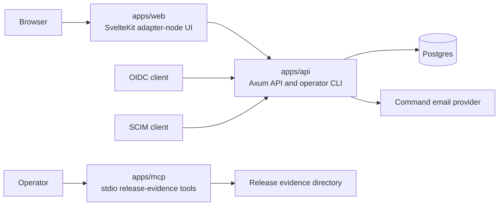
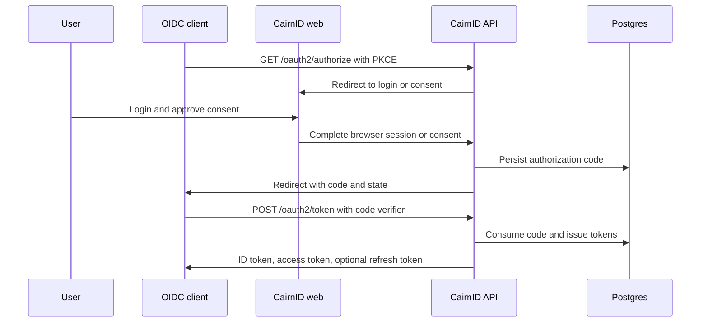
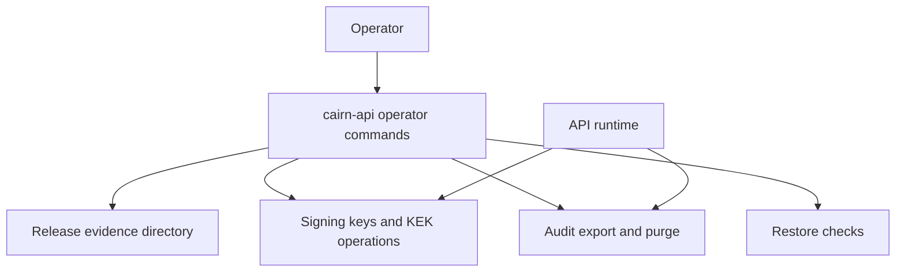

Cairn Identity is a monorepo with one Rust API, one SvelteKit web app, and focused Rust crates for reusable domain logic.

## Runtime Components



```text
Browser
  -> apps/web  SvelteKit adapter-node UI
  -> apps/api  Axum API, OIDC/OAuth provider, SCIM provider, operator CLI
       -> Postgres
```

The web app is stateless. It serves login, consent, user, and admin screens, then calls the API with cookie credentials and CSRF headers.

The API owns migrations, sessions, OAuth grants, MFA ceremonies, account lifecycle tokens, signing keys, audit events, SCIM provisioning, and operational commands.

## Authorization Code Flow



## Operational Boundaries



## Crates

- `cairn-domain`: organization-scoped entities and validation types.
- `cairn-authn`: password hashing, random secrets, PKCE, TOTP, and WebAuthn helpers.
- `cairn-oidc`: OIDC/OAuth policy, discovery, claims, and signing helpers.
- `cairn-database`: SQLx repositories, migrations, row mapping, and persistence DTOs.
- `cairn-audit`: audit event builders and metadata redaction.
- `cairn-api`: Axum routing, protocol endpoints, admin/session APIs, SCIM endpoints, deployment health checks, and operator commands.
- `cairnid-mcp`: local stdio MCP server exposing read-only release-evidence plan, manifest, status, and check tools.

## API Boundaries

The API keeps HTTP parsing and response shaping near the route layer while shared protocol helpers live under focused modules:

- `http/oauth_*`: OAuth form parsing, bearer handling, token exchange, introspection, revocation, and UserInfo helpers.
- `http/oidc_*` and `http/authorization`: browser authorization, consent retry state, logout, and redirect response helpers.
- `http/scim_*`: SCIM authentication, query parsing, projection, resource rendering, PATCH, Bulk, and metadata helpers.
- `http/admin_*`: admin user, group, OIDC client, consent, audit, and pagination handlers.
- `http/mfa*` and `http/account_*`: MFA and account lifecycle routes.
- `operations_*`: preflight, release evidence, public-surface smoke checks, restore checks, and dependency-policy evidence.

## Storage

Postgres is the only application database. Migrations live in `infra/migrations` and are embedded by SQLx. Migration filenames use contiguous four-digit numeric prefixes, and tests reject duplicate, missing, or malformed versions.

Tenant isolation is enforced through organization-scoped rows and tenant-bound repository methods. Sensitive runtime tokens are stored as hashes or encrypted payloads where applicable.

## Deployment

The API and web UI ship as separate containers:

- Root `Dockerfile`: builds and runs `cairn-api`.
- `apps/web/Dockerfile`: builds and runs the SvelteKit adapter-node app.
- `infra/docker-compose.yml`: local Postgres, API, and web stack.
Both long-running services expose `/healthz`. The API health check verifies HTTP serving and Postgres reachability; the web health check verifies the adapter-node runtime.
